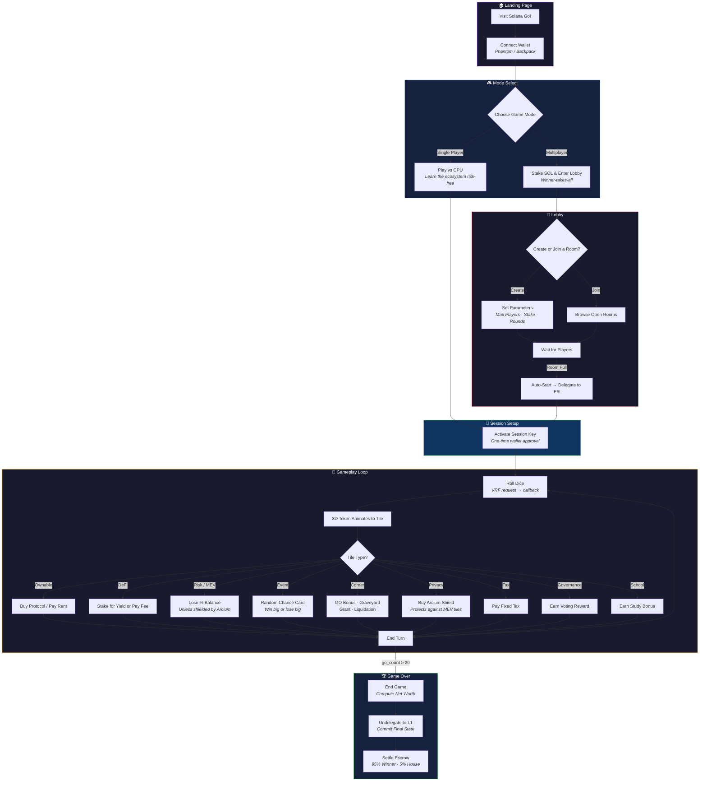
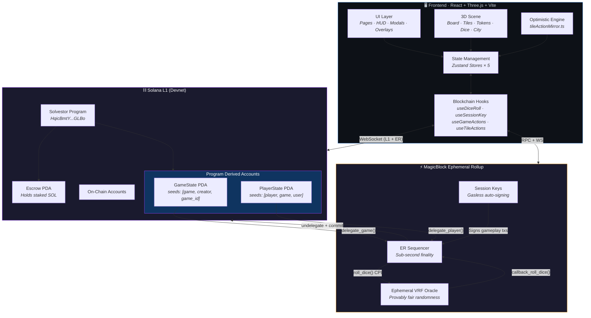
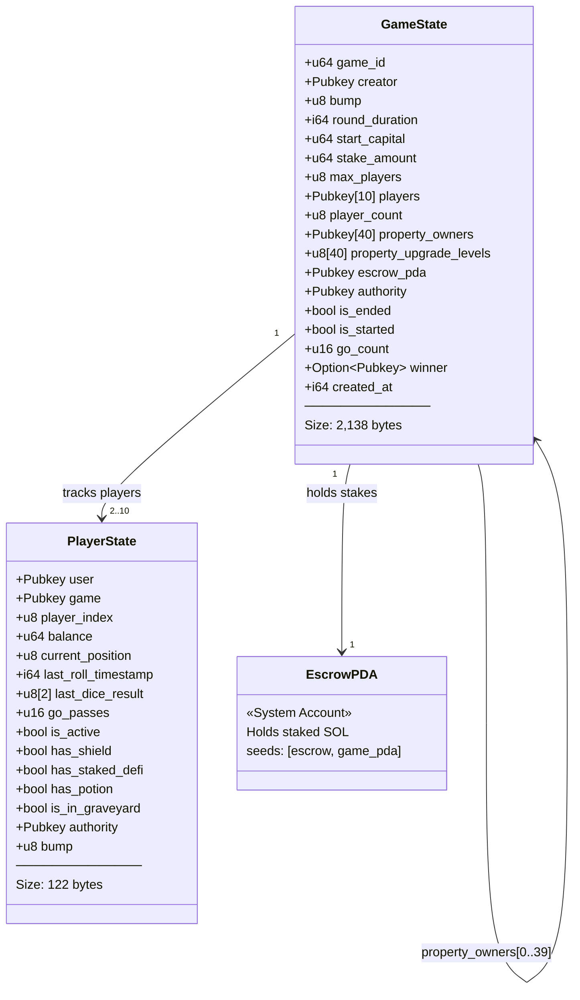
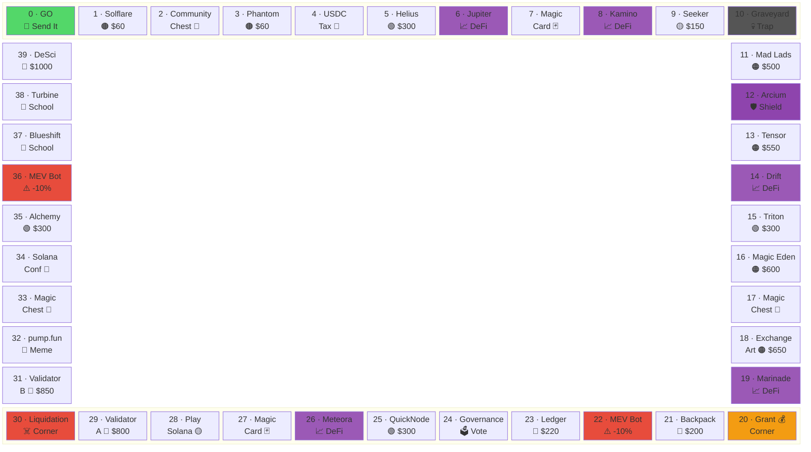
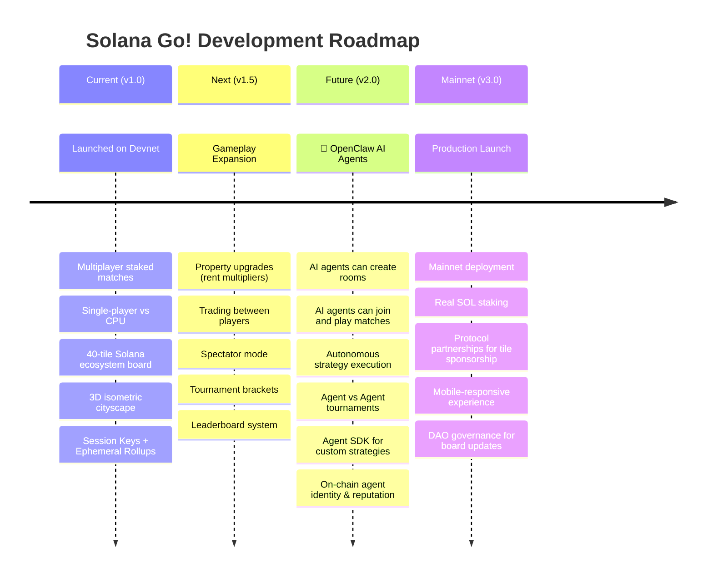

# 🎲 Solana Go!

### A fully on-chain, multiplayer capital allocation strategy game built on Solana

*Roll the dice. Buy protocols. Collect rent. Outplay everyone.*

[**▶️ Watch Demo**](https://youtu.be/-u-THWvy9VA) · [**🎮 Play on Devnet**](https://solana-go.vercel.app/) · [**📄 Program Docs**](./solvestor_program/README.md) · [**🖥️ Frontend Docs**](./solvestor_app/README.md)

---

## 📋 Table of Contents

- [Overview](#-overview)
- [User Flow](#-user-flow)
- [System Architecture](#-system-architecture)
- [Solana Program Deep Dive](#-solana-program-deep-dive)
- [Frontend Architecture](#-frontend-architecture)
- [Project Structure](#-project-structure)
- [Getting Started](#-getting-started)
- [Running Tests](#-running-tests)
- [Roadmap](#-roadmap)
- [License](#-license)

---

## 🌟 Overview

**Solana Go!** transforms the Solana ecosystem into a competitive, 3D board game. Players traverse a 40-tile board where traditional properties are replaced by **real Solana protocols** — spanning DeFi, NFTs, Infrastructure, Privacy, and Gaming. Every move is a capital allocation decision. Luck moves you, but **strategy makes you rich**.

### What Makes It Different

| Feature | Description |
|---|---|
| **100% On-Chain** | All game logic runs in an Anchor smart contract — no off-chain servers |
| **Real Protocols as Tiles** | Jupiter, Helius, Arcium, Mad Lads, Meteora, and 35+ more |
| **Staked Multiplayer** | Players stake SOL to enter; winner takes 95%, house takes 5% |
| **Zero Wallet Popups** | Session Keys sign all gameplay transactions silently in the background |
| **Sub-Second Turns** | Ephemeral Rollups process moves at sequencer speed, not L1 speed |
| **Provably Fair Dice** | Ephemeral VRF delivers un-gameable randomness via cryptographic callback |
| **3D Experience** | React Three Fiber renders an immersive isometric cityscape board |

---

## 🚀 User Flow



---

## 🏗️ System Architecture

### High-Level Architecture



### Smart Contract Lifecycle (L1 ↔ Ephemeral Rollup)

The game operates across **four distinct phases**, seamlessly transitioning between Solana L1 and the MagicBlock Ephemeral Rollup:

```mermaid
sequenceDiagram
    participant P as 👤 Player (Browser)
    participant L1 as ⛓️ Solana L1
    participant ESC as 💰 Escrow PDA
    participant ER as ⚡ Ephemeral Rollup
    participant VRF as 🎲 VRF Oracle

    rect rgb(25, 25, 50)
    Note over P,ESC: Phase 1 — Room Creation & Matchmaking (L1)
    P->>L1: create_room(game_id, round_duration,<br/>start_capital, stake_amount, max_players)
    L1->>L1: Init GameState PDA + Creator PlayerState PDA
    L1->>ESC: Transfer creator's stake to Escrow
    P->>L1: join_room()
    L1->>L1: Init joiner's PlayerState PDA
    L1->>ESC: Transfer joiner's stake to Escrow
    L1-->>L1: Auto-start when player_count == max_players
    end

    rect rgb(50, 30, 10)
    Note over P,ER: Phase 2 — Delegation & Session Auth
    P->>L1: delegate_game(game_id)
    L1->>ER: Migrate GameState → ER Sequencer
    P->>L1: delegate_player() (each player)
    L1->>ER: Migrate PlayerState → ER Sequencer
    P->>ER: Create Session Token (one-time wallet sign)
    Note right of ER: All future txs signed by<br/>ephemeral session key
    end

    rect rgb(10, 50, 30)
    Note over P,VRF: Phase 3 — Gameplay Loop (ER, gasless)
    loop Every Turn
        P->>ER: roll_dice(client_seed) — signed by Session Key
        ER->>VRF: CPI → request randomness
        VRF-->>ER: callback_roll_dice(randomness 32 bytes)
        Note right of ER: die_1 = (hash mod 6) + 1<br/>die_2 = (hash mod 6) + 1<br/>Move player, check GO crossing
        P->>ER: perform_tile_action(tile_index, choose_action)
        Note right of ER: Execute tile effect: rent, yield,<br/>tax, risk, shield, potion, etc.
        opt Ownable + Unowned Tile
            P->>ER: buy_property(tile_index)
        end
    end
    end

    rect rgb(50, 10, 50)
    Note over P,L1: Phase 4 — Settlement & Payout
    P->>ER: end_game(game_id) requires go_count >= 20
    Note right of ER: Compute winner by Net Worth<br/>balance + sum of owned tile values
    ER-->>L1: Commit & undelegate GameState to L1
    P->>L1: settle_game(game_id)
    L1->>ESC: Distribute: 95% → Winner, 5% → House
    end
```



---

## 🔬 Solana Program Deep Dive

> **Program ID**: `CGpK4bRB6DybtWXiTTHXaeoY8RGTCz3cPyHZShaboY23`
>
> **Framework**: Anchor 0.32.1 · **SDK**: Ephemeral Rollups 0.6.5 · VRF 0.2.1 · Session Keys 3.0.10

### On-Chain Account Schema



### Instruction Reference

| # | Instruction | Layer | Description |
|---|---|---|---|
| 1 | `create_room` | L1 | Init `GameState` + creator `PlayerState` + `Escrow`. Transfer stake. |
| 2 | `join_room` | L1 | Init joiner `PlayerState`, transfer stake. Auto-starts at `max_players`. |
| 3 | `start_game` | L1 | Manual start (if not auto-started). Requires `player_count ≥ 2`. |
| 4 | `delegate_game` | L1 | Delegate `GameState` PDA to MagicBlock Ephemeral Rollup. |
| 5 | `delegate_player` | L1 | Delegate `PlayerState` PDA to MagicBlock Ephemeral Rollup. |
| 6 | `roll_dice` | ER | CPI to Ephemeral VRF oracle. Enforces 20s cooldown between rolls. |
| 7 | `callback_roll_dice` | ER | VRF callback. Derives `die_1`, `die_2` from 32-byte hash. Moves player. |
| 8 | `perform_tile_action` | ER | Executes tile-specific logic (rent, yield, tax, risk, events, shields). |
| 9 | `buy_property` | ER | Purchase an unowned, ownable tile. Deducts buy price from balance. |
| 10 | `pay_rent` | ER | Explicit rent payment to property owner (also handled by `perform_tile_action`). |
| 11 | `leave_room` | ER→L1 | Player forfeits. Sets `is_active=false`, balance=0. Commits + undelegates. |
| 12 | `end_game` | ER→L1 | Computes winner by net worth. Commits + undelegates `GameState` to L1. |
| 13 | `settle_game` | L1 | Distributes escrow: 95% to winner, 5% house fee. |

### Board Layout — 40 Tiles

The board is a 40-tile loop mirroring a real Monopoly board, but every tile represents a **real Solana ecosystem entity**:



### Tile Types & Game Mechanics

| Type | Tiles | Mechanic |
|---|---|---|
| **Ownable** | Solflare, Phantom, Helius, Mad Lads, Tensor, Magic Eden, Exchange Art, Validators, etc. | Buy for listed price. Collect rent when opponents land. Rent scales with color-group monopoly (OwnedCountMultiplier) or flat rate. |
| **DeFi** | Jupiter, Kamino, Drift, Marinade, Meteora | Stake `$200` for passive yield (`+$25` each landing). Non-stakers pay `$20` fee. |
| **Risk / MEV** | MEV Bot ×2 | Lose **10%** of liquid balance — unless protected by an **Arcium Shield**. |
| **Privacy** | Arcium | Buy a shield (`$200`) to deflect the next MEV attack. One-time use. |
| **Event** | Community Chest, Magic Card, pump.fun | Random chance card: win `$50–$300` or lose `$50–$200`. |
| **Tax** | USDC Tax | Flat `$200` deducted from balance. |
| **Corner** | GO, Graveyard, Grant, Liquidation | **GO**: +$200 bonus each pass. **Graveyard**: trapped, 40% penalty, need doubles to escape (or BioDAO potion). **Grant**: bonus. **Liquidation**: penalty. |
| **Governance** | Governance | Earn `$25` voting reward. |
| **School** | Turbine, Blueshift | Earn `$50` study bonus. |

### Game Constants

```
GO_BONUS              = 200        HOUSE_FEE_BPS         = 500 (5%)
ROLL_COOLDOWN         = 20s        GRAVEYARD_PENALTY_BPS = 4000 (40%)
MIN_GO_COUNT_TO_END   = 20         SCHOOL_BONUS          = 50
DEFI_STAKE_COST       = 200        GOVERNANCE_BONUS      = 25
DEFI_LANDING_YIELD    = 25         POTION_COST           = 500
SHIELD_COST           = 200        TAX_AMOUNT            = 200
MEV_PENALTY_BPS       = 1000 (10%)
```

---

## 🖥️ Frontend Architecture

> **Stack**: React 18 · TypeScript · Vite · React Three Fiber · Zustand · React Router

```mermaid
graph LR
    subgraph Pages
        LP[LandingPage]
        MS[ModeSelectPage]
        LB[LobbyPage]
        GP[GamePage]
    end

    subgraph Stores["Zustand Stores"]
        BS[useBlockchainStore<br/><i>L1 + ER connections<br/>Program instances<br/>Account subscriptions</i>]
        GS[useGameStore<br/><i>Game state mirror<br/>Turn logic<br/>Player tracking</i>]
        CS[useCameraStore<br/><i>Orbit controls<br/>Follow-cam</i>]
        US[useUIStore<br/><i>Modals, overlays<br/>Theme toggle</i>]
        AS[useAppStore<br/><i>App-level state</i>]
    end

    subgraph Hooks
        DR[useDiceRoll]
        SK[useSessionKey]
        GA[useGameActions]
        TA[useTileActions]
        TM[useTokenMovement]
        CPU[useCPUPlayer]
        RS[useRemotePlayerSync]
    end

    subgraph Scene["3D Scene (R3F)"]
        B[Board]
        T[Tile × 40]
        PT[PlayerToken]
        DS[DiceScene]
        ENV[Environment<br/><i>City · Skyline · Roads</i>]
        CAM[CameraController]
    end

    subgraph UI["UI Overlay"]
        HUD[HUD]
        TAP[TileActionPopup]
        EC[EventCard]
        DB[DiceButton]
        PM[PortfolioModal]
        CRM[CreateRoomModal]
        SSO[SessionSetupOverlay]
    end

    subgraph Engine
        MIRROR[tileActionMirror.ts<br/><i>Deterministic Rust mirror<br/>for optimistic rendering</i>]
    end

    LP --> MS --> LB --> GP
    GP --> Scene
    GP --> UI
    GP --> Hooks
    Hooks --> Stores
    Hooks --> Engine
    Scene --> Stores

    style Pages fill:#1a1a2e,stroke:#58a6ff,color:#fff
    style Stores fill:#0d1117,stroke:#9945FF,color:#c9d1d9
    style Hooks fill:#0d1117,stroke:#f39c12,color:#c9d1d9
    style Scene fill:#0d1117,stroke:#53d769,color:#c9d1d9
    style UI fill:#0d1117,stroke:#e94560,color:#c9d1d9
    style Engine fill:#0d1117,stroke:#ff6b6b,color:#c9d1d9
```



### Key Design Decisions

- **Optimistic Mirror Engine** — `tileActionMirror.ts` is a pure-TypeScript replication of the Rust `perform_tile_action` logic. When a 3D token lands on a tile, the frontend **instantly** computes the expected state change and updates the HUD, while a fire-and-forget transaction is dispatched to the ER in the background.

- **Dual-Connection WebSockets** — `useBlockchainStore` maintains **simultaneous** WebSocket connections to both Solana L1 (for room lifecycle) and the MagicBlock ER (for gameplay). Account subscriptions switch based on game phase.

- **Session Key Flow** — `useSessionKey` generates an ephemeral `Keypair` in browser memory. The user signs **one** L1 transaction to delegate signing authority. All subsequent gameplay txs are silently signed by this temp key — delivering a Web2-like experience.

- **CPU Player** — `useCPUPlayer` implements AI logic for single-player mode, making buy/stake decisions and automatically rolling dice with configurable delays.

---

## 📁 Project Structure

```
solvestor_game/
├── README.md                            ← You are here
│
├── solvestor_program/                   ← Anchor Solana Program
│   ├── Anchor.toml                      ← Cluster config, program ID
│   ├── Cargo.toml                       ← Workspace manifest
│   ├── programs/
│   │   └── solvestor_program/
│   │       ├── Cargo.toml               ← Dependencies (anchor, ER SDK, VRF, session-keys)
│   │       └── src/
│   │           ├── lib.rs               ← Program entrypoint (12 instructions)
│   │           ├── state.rs             ← GameState & PlayerState accounts
│   │           ├── constants.rs         ← Tile configs, game constants, rent calc
│   │           ├── errors.rs            ← 24 custom error codes
│   │           └── instructions/
│   │               ├── create_room.rs   ← Room + escrow initialization
│   │               ├── join_room.rs     ← Join + auto-start logic
│   │               ├── start_game.rs    ← Manual game start
│   │               ├── delegate.rs      ← L1 → ER delegation (game + player)
│   │               ├── roll_dice.rs     ← VRF request + callback handler
│   │               ├── perform_tile_action.rs  ← Core tile logic (20KB)
│   │               ├── buy_property.rs  ← Property purchase
│   │               ├── pay_rent.rs      ← Rent collection with formulas
│   │               ├── leave_room.rs    ← Forfeit + undelegate
│   │               ├── end_game.rs      ← Winner computation + commit
│   │               ├── settle_game.rs   ← Escrow payout (95/5 split)
│   │               └── mod.rs           ← Module re-exports
│   ├── tests/
│   │   └── solvestor_program.ts         ← Integration test suite (6 phases)
│   └── docs/                            ← Additional documentation
│
├── solvestor_app/                       ← React Frontend
│   ├── vite.config.ts                   ← Vite build config
│   ├── vercel.json                      ← Deployment config
│   ├── index.html                       ← Entry HTML
│   └── src/
│       ├── App.tsx                      ← Router: Landing → Mode → Lobby → Game
│       ├── main.tsx                     ← React DOM mount + providers
│       ├── anchor/                      ← IDL + program types
│       ├── config/
│       │   ├── boardTiles.ts            ← 40-tile schema (mirrors constants.rs)
│       │   ├── onChainConstants.ts      ← Program ID, RPC endpoints
│       │   ├── game.ts                  ← Game config defaults
│       │   ├── players.ts              ← Player color/token config
│       │   └── theme.ts                ← Theme tokens
│       ├── engine/
│       │   └── tileActionMirror.ts      ← Optimistic Rust logic mirror
│       ├── stores/                      ← Zustand state management
│       ├── hooks/                       ← Blockchain interaction hooks
│       ├── pages/                       ← 4 route pages
│       ├── scene/                       ← React Three Fiber 3D components
│       ├── ui/                          ← 17 HUD/modal/overlay components
│       ├── types/                       ← TypeScript type definitions
│       ├── utils/                       ← Helpers
│       └── assets/                      ← Images, fonts, textures
```

---

## 🗺️ Roadmap



### 🦀 OpenClaw AI Agents — The Future of Solana Go!

> *What if AI agents could play the game too?*

In a future release, **OpenClaw** 🦀 AI Agents will be first-class participants in the Solana Go! ecosystem:

- **Create Rooms** — Agents spin up their own matches with configurable parameters
- **Join & Play** — Autonomous agents compete against humans and other agents in staked games
- **Strategic Autonomy** — Each agent runs its own capital allocation strategy: aggressive buyers, yield farmers, risk-averse hoarders, or dynamic portfolio optimizers
- **Agent Tournaments** — Dedicated agent-vs-agent lobbies to stress-test and evolve strategies
- **Open SDK** — A public SDK for anyone to build, deploy, and monetize their own OpenClaw agent
- **On-chain Reputation** — Agent performance tracked on-chain with win rates, ROI, and strategy profiles

This opens Solana Go! to the rapidly growing ecosystem of **autonomous on-chain agents**, turning the game into a perpetual, AI-driven economic simulation of the Solana ecosystem.

---

## 🚀 Getting Started

### Prerequisites

| Tool | Version | Purpose |
|---|---|---|
| **Node.js** | ≥ 18 | Frontend + test runner |
| **Yarn** | ≥ 1.22 | Program dependency management |
| **Rust** | stable | Solana program compilation |
| **Anchor CLI** | 0.32.x | Build & deploy framework |
| **Solana CLI** | ≥ 1.18 | Cluster management, keypair tooling |
| **Wallet** | Phantom / Backpack | Devnet interaction |

### 1. Clone & Install

```bash
git clone https://github.com/your-org/solvestor_game.git
cd solvestor_game
```

### 2. Build & Deploy the Smart Contract

```bash
cd solvestor_program
yarn install
anchor build
anchor deploy    # Deploys to the cluster in Anchor.toml
```

### 3. Run the Frontend

```bash
cd solvestor_app
npm install
npm run dev      # Opens at http://localhost:5173
```

> **Note**: The frontend connects to Solana Devnet and MagicBlock's Devnet ER by default. Ensure your wallet is set to **Devnet** and has SOL from a faucet.

---

## 🧪 Running Tests

The integration test suite lives at `solvestor_program/tests/solvestor_program.ts` and validates the **entire game lifecycle** end-to-end across L1 and the Ephemeral Rollup.

### Test Phases

| Phase | Tests | What's Verified |
|---|---|---|
| **1. Room Lifecycle (L1)** | `create_room`, `join_room` | GameState init, PlayerState init, escrow funding, auto-start at max players |
| **2. Delegation (L1→ER)** | `delegate_game`, `delegate_player` ×2 | GameState + both PlayerStates migrated to ER sequencer |
| **3. Dice Rolling (ER+VRF)** | `roll_dice` ×2, `perform_tile_action` ×2, `buy_property` | VRF randomness, dice bounds (1-6), tile actions, property purchase |
| **4. Additional Rounds (ER)** | `roll_dice` (round 2), `perform_tile_action (choose_action=true)` | Cooldown enforcement, shield/DeFi/potion purchase flows |
| **5. State Verification (ER)** | Game state consistency, player state consistency | Property ownership, GO count, player positions, balances |
| **6. Leave Room (ER→L1)** | `leave_room` | Player deactivation, balance zeroed, commit to L1, undelegate |

### Prerequisites

1. **Fund a Player 2 keypair** — the test uses two players. Generate and fund a second keypair:

```bash
cd solvestor_program
solana-keygen new -o player2-keypair.json
solana airdrop 2 $(solana-keygen pubkey player2-keypair.json) --url devnet
```

2. **Set the Ephemeral Rollup endpoint** (optional — defaults to `https://devnet-eu.magicblock.app/`):

```bash
export EPHEMERAL_PROVIDER_ENDPOINT="https://devnet-eu.magicblock.app/"
export EPHEMERAL_WS_ENDPOINT="wss://devnet-eu.magicblock.app/"
```

### Run the Tests

```bash
cd solvestor_program
anchor test --skip-local-validator
```

This runs `yarn run ts-mocha -p ./tsconfig.json -t 1000000 "tests/**/*.ts"` as configured in `Anchor.toml`.

> **⏱️ Timeout**: Tests have a 1,000-second timeout due to the 20-second roll cooldown between rounds and network latency to the ER. A full run typically takes 60–90 seconds.

After completion, the test suite prints a **Transaction Timing Summary** table showing per-instruction latency across L1 and ER layers.

---

## 📄 License

MIT — see [LICENSE](./LICENSE) for details.

---

**Built for the Solana ecosystem. Powered by MagicBlock.**

*Compete. Allocate. Dominate.* 🎲
