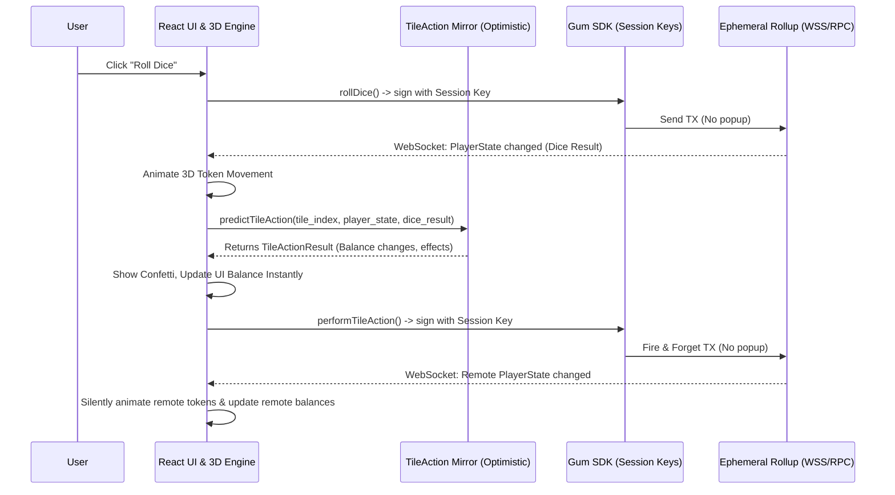

# Solana Go! React App

The Solana Go! React web application is the frontend client for the Solana Go! game. It combines a rich, interactive 3D board (rendered with Three.js / React Three Fiber) with real-time Solana blockchain integrations.

The app is specifically designed to abstract away blockchain friction using **MagicBlock Ephemeral Rollups** and **Session Keys**, offering a Web2-like multiplayer experience while remaining fully on-chain.

## Architecture

The frontend acts as an optimistic orchestrator. It renders 3D animations immediately using a local game engine, while concurrently syncing with the Ephemeral Rollup (ER) in the background.

## Core Modules

### 1. Connection & Session Management
- **`useSessionKey.ts`**: The backbone of the Web2-like UX. When a player readies up, this hook generates a temporary `Keypair` derived from their public key, funds it, and asks the user to sign *once* with their main wallet to authorize it as a delegate. All subsequent game transactions (`rollDice`, `buyProperty`) are signed by this temporary key in the background.
- **`useBlockchainStore.ts`**: Manages WebSockets (`onAccountChange`) for both L1 and ER connections. It deduplicates active games in the lobby and subscribes to the current `GameState` and `PlayerState` PDAs to keep the UI in perfect sync with the chain.

### 2. Gameplay Actions
- **`useGameActions.ts`**: Exposes the core instructions (`rollDice`, `buyProperty`, `performTileAction`, `endGame`).
- These actions construct the Anchor CPI calls and pass them to the `useSessionKey` hook to be dispatched over the Ephemeral RPC without ever prompting the user's wallet.

### 3. The Optimistic Engine
To prevent UI lag while waiting for ER confirmations (even though they are fast), Solvestor uses an optimistic engine:
- **`tileActionMirror.ts`**: A pure TypeScript replication of the Rust `perform_tile_action.rs` contract. When a player lands on a tile, the frontend feeds the local state into this mirror. It instantly returns the predicted state changes (e.g., `-200 USDC` for a Tax tile), allowing the UI to show floating text and update the HUD without waiting for the network.
- **Fire-and-Forget**: The UI dispatches custom events (e.g., `solvestor:performTileAction`) which trigger the actual transaction in the background, knowing it will succeed exactly as the mirror predicted.

### 4. 3D Scene & Rendering
- **`GameScene.tsx` & `PlayerToken.tsx`**: Renders the monopoly board. Uses `framer-motion-3d` for smooth token movement along predefined paths.
- **`useRemotePlayerSync.ts`**: Listens for property and position changes from other players via the WebSocket subscriptions and quietly updates their 3D token representations on the local client's screen.

## Game Modes

| Mode | Description | Networking |
| --- | --- | --- |
| **Explore** | Single-player sandbox mode for testing the board visually. CPU bots take automatic turns. | Local State Only (Zustand) |
| **Beginner** | The live, on-chain Multiplayer mode. Connects to the MagicBlock devnet ER cluster. Requires wallet and session keys. | Ephemeral Rollup + L1 Escrow |

## UI Overlays

The game extensively uses floating overlays (`z-index` staging) above the 3D canvas:
1. **`SessionSetupOverlay`**: The critical UI that prompts the user to "Activate Session" before they can take their first turn, bridging the gap between L1 connection and ER gameplay.
2. **`TileActionPopup`**: A glassmorphism modal that appears when an action requires user input (e.g., choosing to buy a Privacy Shield or staking in DeFi) or when a Chance/Chest card is drawn.
3. **`WaitingOverlay`**: Blocks the screen while the game waits for `GameState.playerCount == GameState.maxPlayers` to automatically start.
