# Solvestor (SWS) — Comprehensive UI/UX Implementation Plan

## Overview

Build a premium, mobile-first, 3D WebGL board game UI for **Solvestor: Solana Wall Street** — a PvP capital allocation strategy game inspired by Monopoly, themed around the Solana ecosystem. This phase is **UI/UX only**: all data is mocked locally, no blockchain integration.

---

## Analysis of Your Original Plan

### ✅ What's Strong

| Area | Why It Works |
|------|-------------|
| **Tech stack** (Vite + R3F + Zustand + Framer Motion) | Industry-proven combo for interactive 3D web apps |
| **Camera follows player** | Critical for mobile — showing the full board at once kills the experience |
| **Separation of state and rendering** | Essential for multiplayer/blockchain later |
| **Mobile-first** | Right priority for a Solana game (most crypto users are on mobile) |
| **Glassmorphism UI overlays** | Premium feel without competing with the 3D layer |
| **Step-by-step token animation** | Monopoly's identity — skipping this would feel cheap |
| **TypeScript + constants** | Non-negotiable for a production game |

### ⚠️ What I'm Improving

| Original Idea | Problem | My Improvement |
|---------------|---------|----------------|
| "~40 tiles as 3D planes" | Flat planes with text labels will look flat and generic | **Tile cards with 3D depth** — extruded geometry, category-based color coding, icon system, subtle billboard labels using `@react-three/drei` |
| "Slight tilt ~25°" | Fixed angle gets boring fast | **Adaptive tilt** — 25° default but smoothly adjusts (20°–35°) based on context (zoom in = steeper, overview = shallower) |
| Camera "follows active player" | No way for player to explore board | **Dual-mode camera**: autopilot (follows token) + free-look (touch/drag to explore, snap-back button to return) |
| "Mock 2 dice" | No visual dice = feels placeholder | **3D animated dice** in R3F scene with physics-inspired tumble, result displayed on dice faces |
| Tile data in state | Mixing tile config with runtime state | **Separate tile registry** (static config) from game state (runtime). Tile definitions become a typed constant map |
| "Neon purple/green" | Neon overload kills readability | **Restrained accent palette** — Solana purple as primary accent, green for wealth/gains, red for losses, with neutral dark canvas. Neon only on interactive elements |
| No sound architecture | Sound is 50% of premium feel | **Sound manager hook** scaffolded now (plays no audio yet but has the API ready for sfx: dice roll, tile land, purchase, etc.) |
| No onboarding | Users won't know what to do | **First-time tutorial overlay** — 3 slides explaining the game, dismissable, stored in localStorage |
| Single game mode | Can't test without someone else | **Solo exploration mode** in V1 — single player rolls and moves to test the full UX flow, with CPU opponent placeholder |
| No tile categorization | All tiles feel the same | **Tile categories** with distinct visual treatment: Property, Utility, Event, Tax, Corner. Each category has a color band, icon, and unique action schema |

---

## Architecture Overview

```mermaid
graph TD
    subgraph "Rendering Layer (R3F)"
        Canvas["R3F Canvas"]
        Board["Board Component"]
        Tiles["Tile Meshes"]
        Tokens["Player Tokens"]
        Dice["3D Dice"]
        Camera["Camera Controller"]
        Lights["Lighting Rig"]
    end

    subgraph "State Layer (Zustand)"
        GameStore["useGameStore"]
        CameraStore["useCameraStore"]
        UIStore["useUIStore"]
    end

    subgraph "UI Layer (React + Framer Motion)"
        HUD["HUD Overlay"]
        BottomSheet["Bottom Sheet"]
        Portfolio["Portfolio Modal"]
        Actions["Action Popups"]
        DiceBtn["Dice Button"]
    end

    subgraph "Data Layer (Constants)"
        TileRegistry["Tile Registry"]
        GameConfig["Game Config"]
        ThemeTokens["Theme Tokens"]
    end

    GameStore --> Board
    GameStore --> Tokens
    GameStore --> HUD
    CameraStore --> Camera
    UIStore --> BottomSheet
    UIStore --> Portfolio
    UIStore --> Actions
    TileRegistry --> Tiles
    ThemeTokens --> Lights
```



---

## Proposed Changes

### Project Configuration

#### [MODIFY] [package.json](file:///Users/tsmboa/dev/solvestor_game/solvestor_app/package.json)
Add all required dependencies:
- **3D**: `@react-three/fiber`, `@react-three/drei`, `three`, `@types/three`
- **State**: `zustand`
- **UI Animation**: `framer-motion`
- **Styling**: `tailwindcss`, `@tailwindcss/vite`
- **Utility**: `immer` (for immutable state updates in Zustand)

#### [MODIFY] [vite.config.ts](file:///Users/tsmboa/dev/solvestor_game/solvestor_app/vite.config.ts)
Add TailwindCSS v4 vite plugin and path aliases (`@/` → `src/`).

#### [NEW] [tsconfig.app.json](file:///Users/tsmboa/dev/solvestor_game/solvestor_app/tsconfig.app.json)
Add path alias for `@/*` → `./src/*`.

---

### Folder Structure

```
src/
├── main.tsx                    # Entry point
├── App.tsx                     # Root component with Canvas + UI
├── index.css                   # Global styles + Tailwind imports
│
├── config/                     # Static configuration (no runtime state)
│   ├── tiles.ts                # Tile registry: 40 tile definitions
│   ├── game.ts                 # Game constants (starting cash, board size, etc.)
│   ├── theme.ts                # Color tokens, glow settings, material params
│   └── players.ts              # Mock player data (2 players)
│
├── types/                      # TypeScript domain types
│   ├── game.ts                 # Player, Tile, TileCategory, GamePhase, etc.
│   └── camera.ts               # CameraMode, CameraTarget
│
├── stores/                     # Zustand stores (pure logic, no rendering)
│   ├── useGameStore.ts         # Players, turns, ownership, balances
│   ├── useCameraStore.ts       # Camera target, mode, zoom level
│   └── useUIStore.ts           # Active modal, bottom sheet state, theme
│
├── scene/                      # React Three Fiber components (3D only)
│   ├── GameScene.tsx           # Canvas wrapper with lighting + camera
│   ├── Board.tsx               # Board base plane
│   ├── Tile.tsx                # Single tile mesh (reusable)
│   ├── TileGroup.tsx           # Lays out all 40 tiles in square formation
│   ├── PlayerToken.tsx         # 3D token mesh with animation
│   ├── DiceScene.tsx           # 3D dice with tumble animation
│   ├── CameraController.tsx    # Cinematic camera (follow + free-look)
│   └── LightingRig.tsx         # Ambient + directional + accent lights
│
├── ui/                         # 2D overlay components (React + Tailwind + Framer)
│   ├── HUD.tsx                 # Top bar: player info, wealth counter, turn
│   ├── BottomSheet.tsx         # Slide-up tile info panel
│   ├── DiceButton.tsx          # Floating action button to roll
│   ├── PortfolioModal.tsx      # Full-screen modal: owned tiles, net worth
│   ├── TileActionPopup.tsx     # Contextual popup: buy/pay rent/draw card
│   ├── ThemeToggle.tsx         # Dark/Light mode switch
│   ├── TurnBanner.tsx          # "Your Turn" / "Opponent's Turn" banner
│   └── WealthCounter.tsx       # Animated number with $ formatting
│
├── hooks/                      # Custom React hooks
│   ├── useDiceRoll.ts          # Roll 2d6, return value + animation state
│   ├── useTokenMovement.ts     # Animate token from tile A to tile B
│   ├── useTileActions.ts       # Determine what action a tile triggers
│   └── useSoundManager.ts      # Sound API scaffold (no audio files yet)
│
└── utils/                      # Pure utility functions
    ├── boardLayout.ts           # Calculate 3D positions for 40 tiles in square
    ├── easing.ts                # Custom easing functions
    └── formatters.ts            # Currency, number formatting
```

---

### Data Layer (Constants & Types)

#### [NEW] [types/game.ts](file:///Users/tsmboa/dev/solvestor_game/solvestor_app/src/types/game.ts)
Define core types:
- `TileCategory`: `'property' | 'utility' | 'event' | 'tax' | 'corner'`
- `TileDefinition`: `{ id, name, category, price?, rent?, color, description, icon }`
- `Player`: `{ id, name, color, position, balance, ownedTiles, isActive }`
- `GamePhase`: `'waiting' | 'rolling' | 'moving' | 'landed' | 'action'`
- `DiceResult`: `{ die1, die2, total, isDoubles }`

#### [NEW] [types/camera.ts](file:///Users/tsmboa/dev/solvestor_game/solvestor_app/src/types/camera.ts)
- `CameraMode`: `'follow' | 'free' | 'overview'`
- `CameraTarget`: `{ position: Vector3, lookAt: Vector3, zoom: number }`

#### [NEW] [config/tiles.ts](file:///Users/tsmboa/dev/solvestor_game/solvestor_app/src/config/tiles.ts)
Full 40-tile registry. Tiles themed around Solana ecosystem:

| Index | Name | Category | Theme |
|-------|------|----------|-------|
| 0 | Send It | Corner (GO) | Collect salary |
| 1 | Raydium | Property | DEX |
| 2 | Solana FM | Utility | Explorer |
| 3 | Magic Card | Event | Chance equivalent |
| ... | ... | ... | ... |
| 10 | Staking Hub | Corner (Jail) | Stake/unstake |
| 20 | Governance | Corner (Free) | DAO voting |
| 30 | Liquidation | Corner (Go to Jail) | Forced sell |

Each tile has: `id`, `name`, `category`, `price`, `rent`, `colorBand`, `description`.

#### [NEW] [config/game.ts](file:///Users/tsmboa/dev/solvestor_game/solvestor_app/src/config/game.ts)
Constants: `STARTING_BALANCE = 15000`, `BOARD_SIZE = 40`, `TILES_PER_SIDE = 11`, `GO_SALARY = 2000`, `MAX_PLAYERS = 4`.

#### [NEW] [config/theme.ts](file:///Users/tsmboa/dev/solvestor_game/solvestor_app/src/config/theme.ts)
Design tokens:
- Solana purple: `#9945FF`
- Solana green: `#14F195`
- Board dark: `#0a0a0f`
- Accent glow intensity, material params, shadow settings.

#### [NEW] [config/players.ts](file:///Users/tsmboa/dev/solvestor_game/solvestor_app/src/config/players.ts)
Mock data for 2 players with starting positions and balances.

---

### State Layer (Zustand Stores)

#### [NEW] [stores/useGameStore.ts](file:///Users/tsmboa/dev/solvestor_game/solvestor_app/src/stores/useGameStore.ts)
```typescript
interface GameState {
  players: Player[];
  currentPlayerIndex: number;
  phase: GamePhase;
  lastDiceResult: DiceResult | null;
  ownedTiles: Record<number, string>; // tileId → playerId
  // Actions
  rollDice: () => DiceResult;
  movePlayer: (playerId: string, steps: number) => void;
  buyTile: (playerId: string, tileId: number) => void;
  endTurn: () => void;
  payRent: (payerId: string, ownerId: string, amount: number) => void;
}
```
Uses `immer` middleware for immutable updates.

#### [NEW] [stores/useCameraStore.ts](file:///Users/tsmboa/dev/solvestor_game/solvestor_app/src/stores/useCameraStore.ts)
```typescript
interface CameraState {
  mode: CameraMode;
  target: CameraTarget;
  isTransitioning: boolean;
  setTarget: (target: CameraTarget) => void;
  setMode: (mode: CameraMode) => void;
  focusOnTile: (tileIndex: number) => void;
  followPlayer: (playerId: string) => void;
}
```

#### [NEW] [stores/useUIStore.ts](file:///Users/tsmboa/dev/solvestor_game/solvestor_app/src/stores/useUIStore.ts)
```typescript
interface UIState {
  theme: 'dark' | 'light';
  isBottomSheetOpen: boolean;
  bottomSheetTileId: number | null;
  isPortfolioOpen: boolean;
  activePopup: 'buy' | 'rent' | 'event' | null;
  toggleTheme: () => void;
  openBottomSheet: (tileId: number) => void;
  closeBottomSheet: () => void;
  // ...
}
```

---

### 3D Scene Layer

#### [NEW] [scene/GameScene.tsx](file:///Users/tsmboa/dev/solvestor_game/solvestor_app/src/scene/GameScene.tsx)
R3F `<Canvas>` wrapper component. Sets up:
- `frameloop="demand"` for performance (re-render only on state change)
- Shadowed renderer
- Anti-aliasing
- Contains `<Board>`, `<TileGroup>`, `<PlayerToken>`, `<CameraController>`, `<LightingRig>`

#### [NEW] [scene/Board.tsx](file:///Users/tsmboa/dev/solvestor_game/solvestor_app/src/scene/Board.tsx)
The board base:
- Large rounded-rect plane with dark textured material
- Subtle grid pattern in the center
- Faint Solana logo watermark in center (using `drei`'s `<Decal>`)

#### [NEW] [scene/Tile.tsx](file:///Users/tsmboa/dev/solvestor_game/solvestor_app/src/scene/Tile.tsx)
Individual tile component:
- `<RoundedBox>` with slight extrusion (0.05 units height)
- Category color band on the top edge
- `<Text>` label from `@react-three/drei` (billboard text)
- Hover state: emissive glow + slight Y-lift (0.02 units)
- Click handler → opens bottom sheet with tile info
- Owned indicator: player's color outline glow

#### [NEW] [scene/TileGroup.tsx](file:///Users/tsmboa/dev/solvestor_game/solvestor_app/src/scene/TileGroup.tsx)
Positions all 40 tiles in the classic Monopoly square layout using `boardLayout.ts` utility. Handles corner tile sizing (slightly larger).

#### [NEW] [scene/PlayerToken.tsx](file:///Users/tsmboa/dev/solvestor_game/solvestor_app/src/scene/PlayerToken.tsx)
3D token:
- Metallic capsule/chess-pawn shape using `drei` primitives
- Player-colored material with slight emissive glow
- Animated position using `useFrame` + lerp
- Bounce on landing (spring-based Y offset)
- Multiple tokens offset slightly when on same tile

#### [NEW] [scene/DiceScene.tsx](file:///Users/tsmboa/dev/solvestor_game/solvestor_app/src/scene/DiceScene.tsx)
3D dice pair:
- Two cube meshes with dot textures on faces
- Tumble animation triggered by game state
- Final orientation matches rolled values
- Positioned near active player or in fixed viewport corner

#### [NEW] [scene/CameraController.tsx](file:///Users/tsmboa/dev/solvestor_game/solvestor_app/src/scene/CameraController.tsx)
The heart of the mobile experience:
- **Follow mode**: camera lerps to position behind/above active player token, 25° downward tilt
- **Landing zoom**: on `phase === 'landed'`, smoothly zooms in ~30% and tilts to 30°
- **Free mode**: user can drag/pan (touch) to explore, snap-back FAB button appears
- Uses `useFrame` for smooth 60fps interpolation with damping factor
- Boundaries prevent camera from going below the board or too far away

#### [NEW] [scene/LightingRig.tsx](file:///Users/tsmboa/dev/solvestor_game/solvestor_app/src/scene/LightingRig.tsx)
- Ambient light (low intensity, 0.3)
- Directional light (top-right, casts shadows)
- Subtle purple point light beneath board center (atmospheric glow)
- Theme-aware: adjusts intensity for dark vs light mode

---

### UI Overlay Layer

#### [NEW] [ui/HUD.tsx](file:///Users/tsmboa/dev/solvestor_game/solvestor_app/src/ui/HUD.tsx)
Fixed top bar showing:
- Current player name + avatar dot
- Animated wealth counter
- Turn indicator
- Settings gear icon

#### [NEW] [ui/BottomSheet.tsx](file:///Users/tsmboa/dev/solvestor_game/solvestor_app/src/ui/BottomSheet.tsx)
Framer Motion slide-up panel:
- Tile name, category badge, price
- Owner info (if owned)
- Rent table
- Dismiss via swipe-down or tap outside
- Glassmorphism: `backdrop-blur-xl bg-white/5 border border-white/10`

#### [NEW] [ui/DiceButton.tsx](file:///Users/tsmboa/dev/solvestor_game/solvestor_app/src/ui/DiceButton.tsx)
Floating action button (bottom-right):
- Pulsing glow when it's player's turn
- Disabled during animation
- Dice icon with roll animation on press
- Triggers `rollDice()` → `movePlayer()` chain

#### [NEW] [ui/TileActionPopup.tsx](file:///Users/tsmboa/dev/solvestor_game/solvestor_app/src/ui/TileActionPopup.tsx)
Context-dependent popup after landing:
- **Unowned property**: "Buy for $X" / "Auction" buttons
- **Owned by opponent**: "Pay Rent $X" (auto-deduct)
- **Event tile**: Card reveal with description
- Glassmorphism styling, fades in from center

#### [NEW] [ui/PortfolioModal.tsx](file:///Users/tsmboa/dev/solvestor_game/solvestor_app/src/ui/PortfolioModal.tsx)
Full-screen overlay (swipe up for access):
- List of owned tiles with values
- Net worth calculation
- Portfolio composition pie (CSS-only, no chart library)

#### [NEW] [ui/WealthCounter.tsx](file:///Users/tsmboa/dev/solvestor_game/solvestor_app/src/ui/WealthCounter.tsx)
Animated number component:
- Counts up/down smoothly when balance changes
- Green flash on gain, red flash on loss
- Uses `requestAnimationFrame` for smooth counting

#### [NEW] [ui/ThemeToggle.tsx](file:///Users/tsmboa/dev/solvestor_game/solvestor_app/src/ui/ThemeToggle.tsx)
Sun/Moon icon toggle, updates `useUIStore.theme`, applied via CSS custom properties.

#### [NEW] [ui/TurnBanner.tsx](file:///Users/tsmboa/dev/solvestor_game/solvestor_app/src/ui/TurnBanner.tsx)
Cinematic banner that slides in on turn change: "Your Turn" or "Opponent's Turn" with player color.

---

### Hooks Layer

#### [NEW] [hooks/useDiceRoll.ts](file:///Users/tsmboa/dev/solvestor_game/solvestor_app/src/hooks/useDiceRoll.ts)
Encapsulates dice logic:
- Random 1–6 for each die
- Returns `{ die1, die2, total, isDoubles }`
- Manages `isRolling` state for animation timing
- Coordinates with game store

#### [NEW] [hooks/useTokenMovement.ts](file:///Users/tsmboa/dev/solvestor_game/solvestor_app/src/hooks/useTokenMovement.ts)
Animation orchestrator:
- Given start tile and step count, generates waypoint sequence
- Returns current interpolated position for each frame
- Handles wrapping around tile 39 → tile 0
- Triggers camera focus update at each intermediate tile
- Fires callback on final landing

#### [NEW] [hooks/useTileActions.ts](file:///Users/tsmboa/dev/solvestor_game/solvestor_app/src/hooks/useTileActions.ts)
Determines action based on tile category + ownership:
- Returns action type: `'buy' | 'pay_rent' | 'draw_event' | 'pay_tax' | 'corner_action' | null`

#### [NEW] [hooks/useSoundManager.ts](file:///Users/tsmboa/dev/solvestor_game/solvestor_app/src/hooks/useSoundManager.ts)
API scaffold only (no audio files):
```typescript
const { play } = useSoundManager();
play('dice_roll'); // no-op for now, logs to console
```

---

### Utilities

#### [NEW] [utils/boardLayout.ts](file:///Users/tsmboa/dev/solvestor_game/solvestor_app/src/utils/boardLayout.ts)
Pure function: given `BOARD_SIZE` and tile dimensions, returns `Vector3[]` positions + rotations for each tile around the Monopoly square.

#### [NEW] [utils/easing.ts](file:///Users/tsmboa/dev/solvestor_game/solvestor_app/src/utils/easing.ts)
Easing functions: `easeOutCubic`, `easeInOutQuad`, `springBounce` — used for camera and token animations.

#### [NEW] [utils/formatters.ts](file:///Users/tsmboa/dev/solvestor_game/solvestor_app/src/utils/formatters.ts)
`formatCurrency(amount)` → `"$15,000"`, `formatCompact(amount)` → `"$15K"`.

---

### Entry Points

#### [MODIFY] [App.tsx](file:///Users/tsmboa/dev/solvestor_game/solvestor_app/src/App.tsx)
Replace default Vite content with:
- Full-screen layout: `<GameScene>` as background, UI overlay components on top
- Theme provider via CSS class on root element
- Initialize game state on mount

#### [MODIFY] [main.tsx](file:///Users/tsmboa/dev/solvestor_game/solvestor_app/src/main.tsx)
Import Tailwind CSS, render `<App>`.

#### [MODIFY] [index.css](file:///Users/tsmboa/dev/solvestor_game/solvestor_app/src/index.css)
Tailwind v4 imports + CSS custom properties for theme tokens + global reset.

#### [DELETE] [App.css](file:///Users/tsmboa/dev/solvestor_game/solvestor_app/src/App.css)
Remove default Vite styles — everything moves to Tailwind utilities and `index.css`.

---

## User Review Required

> [!IMPORTANT]
> **Tile Count & Names**: I've planned 40 tiles with Solana-themed names from the user's spec. Do you want me to use the exact tile names you listed (Jupiter, MagicBlock, Pump.fun, Validator, Seeker Phone, etc.) or should I fill in additional ones creatively? I need the full list of 40 if you have specific names in mind.

> [!IMPORTANT]
> **TailwindCSS Version**: Your project doesn't have Tailwind installed yet. I plan to use **TailwindCSS v4** (latest, with the Vite plugin). This uses `@import "tailwindcss"` syntax instead of the old `@tailwind` directives. Confirm this is acceptable.

> [!IMPORTANT]
> **Solo vs. Two Player**: For V1, should the "Roll Dice" button alternate between two players (hot-seat mode), or should player 2 be an auto-rolling CPU? I recommend **hot-seat** (both human) since we're testing UX, not AI.

> [!WARNING]
> **Performance Budget**: React Three Fiber on mobile can be heavy. I'll use `frameloop="demand"`, instanced meshes where possible, and keep polygon counts low. But expect ~30-40fps on older phones with all glow effects. We can add a "performance mode" toggle later if needed.

---

## Build Phases (Execution Order)

| Phase | Focus | Depends On |
|-------|-------|------------|
| 1 | Project setup, deps, folder structure, types, constants | — |
| 2 | Zustand stores (all 3) | Types |
| 3 | Board base + tile layout + lighting | Stores, Constants |
| 4 | Camera controller | Stores, Board |
| 5 | Player tokens + movement animation | Stores, Board layout |
| 6 | Dice roll (hook + 3D + button) | Stores, Tokens |
| 7 | UI overlays (HUD, bottom sheet, popups) | Stores |
| 8 | Polish: theme toggle, turn banner, sounds scaffold, easing | All above |

---

## Verification Plan

### Automated Tests
Since this is a UI/UX-first game with heavy visual components, automated unit tests have limited value for the 3D layer. However, I will:

1. **Verify build succeeds**: `cd /Users/tsmboa/dev/solvestor_game/solvestor_app && npm run build` — must exit 0 with no TypeScript errors.
2. **Verify dev server starts**: `npm run dev` — must start without errors and be accessible at localhost.

### Browser Verification (Primary)
Using the browser tool to visually validate each phase:

1. **Board renders**: 3D board visible with 40 tiles in square layout, labels readable
2. **Camera follows**: Click "Roll Dice" → token moves → camera smoothly tracks
3. **Dice works**: Click dice button → dice result shown → token moves correct number of tiles
4. **Landing zoom**: When token lands, camera zooms in slightly
5. **Bottom sheet**: Tap a tile → info panel slides up from bottom with tile details
6. **Mobile layout**: Resize browser to 390×844 (iPhone viewport) → all UI elements accessible, no overflow
7. **Theme toggle**: Switch between dark/light → colors update across board and UI

### Manual Verification (User)
After I complete the build, I'll ask you to:
1. Open the app on your phone's browser and verify touch interactions feel natural
2. Confirm the visual direction matches your "fintech cyber aesthetic" vision
3. Test the full flow: roll → move → land → action popup → end turn
