# Solana Go! Program

Solana Go! is an on-chain, Monopoly-style multiplayer board game built on Solana using the Anchor framework. It leverages bleeding-edge Solana technologies including **MagicBlock Ephemeral Rollups (ER)** for gasless, high-speed gameplay, **Session Keys** for seamless UX (no wallet approvals per move), and **Ephemeral VRF** for true on-chain randomness.

## Architecture

The program is designed around a continuous loop that begins on the Solana Layer 1 (L1), moves execution to an Ephemeral Rollup (ER) for high-frequency gameplay actions, and settles back on L1 when the match concludes.

```mermaid
sequenceDiagram
    participant P as Player (Client)
    participant L1 as Solana L1
    participant ER as Ephemeral Rollup
    participant VRF as Ephemeral VRF

    %% Phase 1: Matchmaking & Setup
    rect rgb(20, 40, 60)
    Note over P,L1: Phase 1: Matchmaking & Setup (L1)
    P->>L1: create_room()
    Note right of L1: Init GameState, Creator PlayerState.<br/>Stake transferred to Escrow PDA.
    P->>L1: join_room()
    Note right of L1: Init Joiner PlayerState.<br/>Stake transferred to Escrow PDA.
    L1-->>L1: Auto-starts when Max Players reached.
    end

    %% Phase 2: ER Transition
    rect rgb(60, 40, 20)
    Note over P,ER: Phase 2: ER Transition
    P->>L1: delegate_game()
    L1->>ER: Moves GameState to ER
    P->>L1: delegate_player()
    L1->>ER: Moves PlayerStates to ER
    P-->>ER: Create Session Token (Session Keys)
    end

    %% Phase 3: Gameplay Loop
    rect rgb(20, 60, 40)
    Note over P,VRF: Phase 3: Gameplay Loop (ER)
    loop Every Player Turn
        P->>ER: roll_dice() (Signed w/ Session Key)
        ER->>VRF: Request Randomness CPI
        VRF-->>ER: callback_roll_dice()
        Note right of ER: Calculates [1-6, 1-6], moves player.<br/>Handles Graveyard escapes, GO bonus.
        P->>ER: perform_tile_action()
        Note right of ER: Pays rent, applies tile effects<br/>(Risk, DeFi, Taxes, Chests, etc.)
        opt Buy Tile
            P->>ER: buy_property()
        end
    end
    end

    %% Phase 4: Match Conclusion
    rect rgb(60, 20, 60)
    Note over P,L1: Phase 4: Match Conclusion & Settlement
    P->>ER: end_game()
    Note right of ER: Computes Winner (Highest Net Worth).<br/>Commits & undelegates to L1.
    ER-->>L1: Undelegate GameState
    P->>L1: settle_game()
    Note right of L1: Escrow payout: 95% Winner, 5% House.
    end
```

## Core Mechanics

### 1. State Management
- **`GameState` (`state.rs`)**: Tracks game settings (max players, stake), overall lifecycle (`is_started`, `is_ended`), tile ownership (`property_owners[40]`), property upgrades, and ESCROW management. It also tracks the highest `go_count` to trigger endgame conditions.
- **`PlayerState` (`state.rs`)**: Stores individual player status, including their balance, board position (0-39), dice history, active effects (shield, potion, defi staked), and graveyard imprisonment.

### 2. High-Frequency Gameplay (Ephemeral Rollups)
Solvestor delegates `GameState` and `PlayerState` to **MagicBlock Ephemeral Rollups**.
- Players do not pay gas fees during the `roll_dice`, `perform_tile_action`, or `buy_property` instructions.
- Operations run at ultra-low latency.
- Transactions are signed automatically using **Gum SDK Session Keys**, meaning users only sign *once* at the start of the match.

### 3. True Randomness (Ephemeral VRF)
To ensure the fairness of dice rolls and chance cards:
- **`roll_dice`**: Calls the Ephemeral VRF program via CPI to request randomness.
- **`callback_roll_dice`**: Executed asynchronously by the VRF network. Provides a 32-byte hash that the program safely modulus-slices into independent `die_1` and `die_2` (1-6) values.

### 4. Economy & Settlement
- Players enter matches by depositing USDC/SOL stakes into a secure **Escrow PDA** upon `create_room` or `join_room`.
- Once `MIN_GO_COUNT_TO_END` is reached, `end_game` calculates the winner by assessing **Net Worth** (Current Balance + Sum of Tile Buy Prices).
- Upon `end_game`, the `GameState` is frozen and securely committed (undelegated) back to Solana L1.
- `settle_game` transfers the pooled funds directly from the Escrow PDA to the winner (`95%`) and the house treasury (`5%`).

## Tile Categories

| Type | Effects | Hook |
| --- | --- | --- |
| **Ownable** | Buyable properties. Opponents pay rent when landing here. | `buy_property`, `calculate_rent` |
| **Event (Chance/Chest)** | Draws random cards applying varying flat/percentage economic effects or forced movements. | `apply_chance_card`, `apply_chest_card` |
| **DeFi** | Allows users to "stake" for a fee, unlocking passive yield on future landings. | `has_staked_defi` check in `perform_tile_action` |
| **Risk / Tax** | Deducts fixed penalties or % balances (e.g., MEV Attacks). | `MEV_PENALTY_BPS`, `TAX_AMOUNT` |
| **Corner Tiles** | Fixed layout elements (e.g., GO (+200), Graveyard (Imprisonment)). | Evaluated in `callback_roll_dice` / `perform_tile_action` |

## Advanced Mechanics
- **Privacy Shields**: Players can purchase shields on the "Arcium" tile to block one incoming negative effect (e.g., MEV tax).
- **BioDAO Potions**: Players can buy potions on the "DeSci" tile. If they are banished to the graveyard, the potion resurrects them instantly.
- **Graveyard Lockout**: Players trapped in the graveyard lose 40% of their balance immediately and cannot act (cannot buy/pay rent) until they roll doubles.
