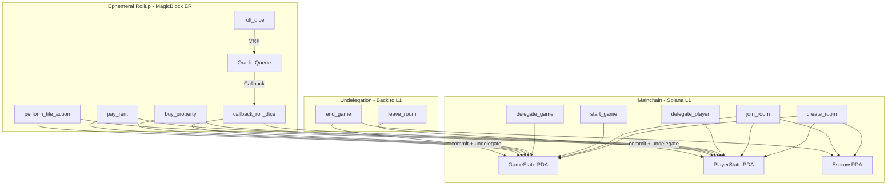
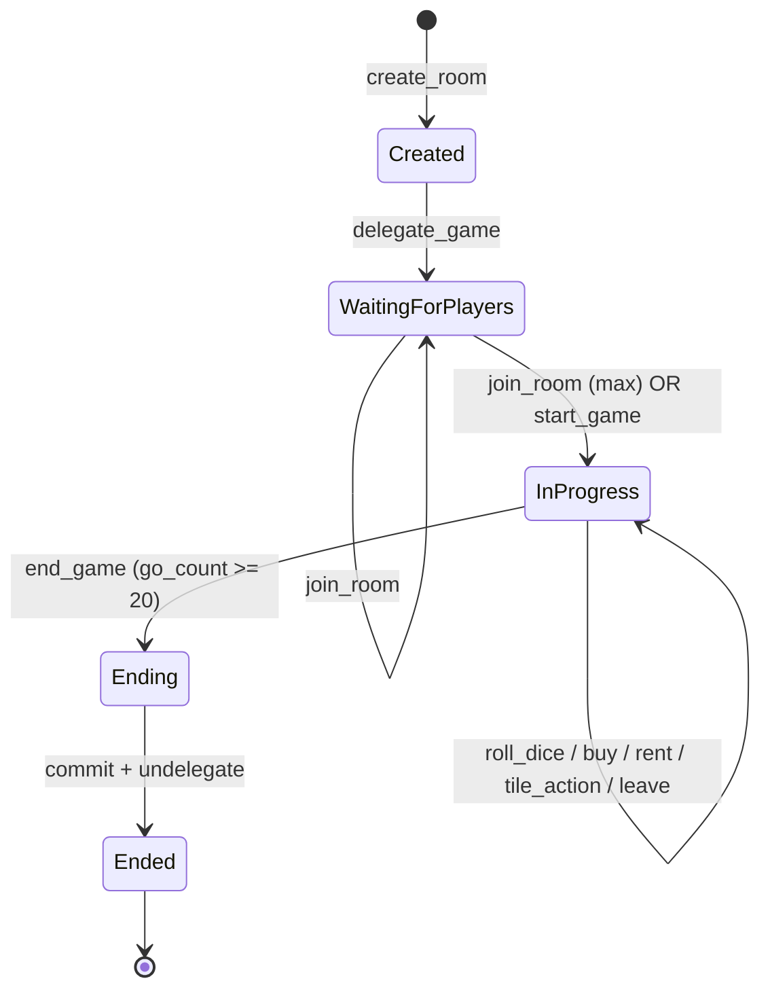

# Solvestor Anchor Program — Final Implementation Plan (v2)

> [!NOTE]
> Updated with all user feedback. Previous "User Review Required" section resolved.

## 1. Previous Implementation Issues (Summary)

| # | Issue | Severity |
|---|---|---|
| 1.1 | Strings in on-chain `PropertyState` (~8KB wasted) | 🔴 Critical |
| 1.2 | `game.properties = vec![]` — never populated, `buy_property` always fails | 🔴 Critical |
| 1.3 | VRF callback discriminator uses hash instead of `instruction::` module | 🔴 Critical |
| 1.4 | Winner passed as client parameter (security hole) | 🔴 Critical |
| 1.5 | `leave_room` doesn't decrement `player_count` | 🟡 Important |
| 1.6 | No per-player `go_count` tracking | 🟡 Design |
| 1.7 | String comparison for rent formula on-chain | 🟠 Moderate |
| 1.8 | No tile landing effects (events, risk, corners) | 🟡 Important |
| 1.9 | No player-in-game validation on `roll_dice` | 🟡 Important |
| 1.10 | Missing `start_game` instruction (manual early start) | 🟡 Missing |

---

## 2. Architecture



### State Machine



---

## 3. Account Structures

### 3.1 `GameState`

```rust
#[account]
pub struct GameState {
    pub game_id: u64,                      // 8
    pub creator: Pubkey,                   // 32
    pub bump: u8,                          // 1
    pub round_duration: i64,               // 8 (cooldown seconds)
    pub start_capital: u64,                // 8
    pub stake_amount: u64,                 // 8
    pub max_players: u8,                   // 1 (1-10)
    pub players: [Pubkey; 10],             // 320
    pub player_count: u8,                  // 1
    pub property_owners: [Pubkey; 40],     // 1280 (default = unowned)
    pub property_upgrade_levels: [u8; 40], // 40
    pub escrow_pda: Pubkey,                // 32
    pub authority: Pubkey,                 // 32
    pub is_ended: bool,                    // 1
    pub is_started: bool,                  // 1
    pub go_count: u16,                     // 2 (highest per-player go_passes)
    pub winner: Option<Pubkey>,            // 33
    pub created_at: i64,                   // 8
}
// ~1816 bytes + 8 discriminator
```

**Property tracking design:** `property_owners[tile_index]` stores the **owner's Pubkey** (or `Pubkey::default()` = unowned). To find all properties owned by player X, iterate `property_owners` and count entries matching `X`. One player can own multiple tiles — each tile slot independently stores its owner.

**`go_count` = highest `go_passes` among all active players.** Updated in `callback_roll_dice` whenever any player passes GO. When `go_count >= 20`, the game can be ended.

### 3.2 `PlayerState`

```rust
#[account]
pub struct PlayerState {
    pub user: Pubkey,                  // 32
    pub game: Pubkey,                  // 32
    pub player_index: u8,              // 1
    pub balance: u64,                  // 8
    pub current_position: u8,          // 1
    pub last_roll_timestamp: i64,      // 8
    pub last_dice_result: [u8; 2],     // 2
    pub go_passes: u16,                // 2
    pub is_active: bool,               // 1
    pub has_shield: bool,              // 1 (Arcium privacy shield)
    pub has_staked_defi: bool,         // 1 (DeFi staking status)
    pub authority: Pubkey,             // 32
    pub bump: u8,                      // 1
}
// ~130 bytes + 8 discriminator
```

### 3.3 On-Chain Tile Config (Hardcoded Constants)

All tile metadata is a static `get_tile_config(index: u8) -> TileConfig` function. No strings. Key types:

```rust
pub enum TileType { Corner, Ownable, DeFi, Event, Risk, Tax, Neutral, Privacy, Governance }
pub enum CornerType { Go, Graveyard, Grant, Liquidation }
pub enum RentFormula { Flat, OwnedCountMultiplier }
pub enum ColorGroup { Brown, LightBlue, Orange, Red, Yellow, Green, DarkBlue, Purple, Grey, None }
```

---

## 4. PDA Seeds

| Account | Seeds |
|---|---|
| `GameState` | `["game", creator.key(), game_id.to_le_bytes()]` |
| `PlayerState` | `["player", game.key(), user.key()]` |
| `Escrow` | `["escrow", game.key()]` |

---

## 5. Instruction Design

### 5.1 `create_room`
**Args:** `game_id, round_duration, start_capital, stake_amount, max_players`
- Init GameState, PlayerState for creator, transfer stake to escrow
- `property_owners = [Pubkey::default(); 40]`

### 5.2 `start_game` *(NEW)*
**Accounts:** `game` (mut), `creator` (signer)
- Allows creator to manually start game early (min 2 players)
- Sets `game.is_started = true`

### 5.3 `delegate_game` / `delegate_player`
- Standard `#[delegate]` + `del` pattern from MagicBlock examples

### 5.4 `join_room`
- Read `stake_amount` from game state
- Auto-start when `player_count == max_players`

### 5.5 `roll_dice` (VRF + Session Keys)
- `instruction::CallbackRollDice::DISCRIMINATOR.to_vec()` for callback
- 20-second cooldown check
- Pass `game` + `player` as callback account metas

### 5.6 `callback_roll_dice` (VRF callback)
- Derive die_1, die_2 from randomness
- Update position, check pass GO
- Update per-player `go_passes` and global `go_count = max(go_count, player.go_passes)`

### 5.7 `buy_property` (Session Keys)
- Verify on tile, ownable, unowned, has balance
- Deduct from balance, set `property_owners[tile_index] = player.user`

### 5.8 `pay_rent` (Session Keys)
- Compute rent from `RentFormula` enum (no string comparison)
- `OwnedCountMultiplier`: count owner's tiles in same `ColorGroup`
- Transfer from player.balance to owner_player.balance

### 5.9 `perform_tile_action` *(Renamed)* (Session Keys)
Unified instruction for all non-ownable tile effects. Takes `tile_index`, checks tile type and applies effect:

| Tile Type | Effect |
|---|---|
| **Corner (GO)** | Already handled in callback |
| **Corner (Graveyard)** | No penalty (just visiting) |
| **Corner (Grant)** | Award 100-300 bonus (pseudo-random from dice) |
| **Corner (Liquidation)** | Move to Graveyard (pos=10), lose 10% balance |
| **Tax (tile 4)** | Deduct 200 |
| **Event (Chance)** | Random card (see below) |
| **Event (Chest)** | Random card (see below) |
| **Event (Meme/pump.fun)** | Random: win 50-500 or lose 50-300 |
| **Event (Solana Conf)** | Award flat 500 |
| **Risk (MEV Bot, tile 22)** | If `has_shield`: protected. Else: lose 10% balance |
| **Risk (MEV Sandwich, tile 36)** | If `has_shield`: protected. Else: lose 10% balance |
| **Privacy (Arcium, tile 12)** | Deduct 200, set `has_shield = true` |
| **DeFi tiles** | If `has_staked_defi`: earn 25 bonus. Else: option to stake (deduct 200, set `has_staked_defi = true`) |
| **Neutral** | No effect |
| **Governance** | No effect (V1) |

**Chance Cards** (pseudo-random from `last_dice_result[0]`):

| Roll (1-6) | Event | Effect |
|---|---|---|
| 1 | "Airdrop Season!" | +200 |
| 2 | "Validator Rewards" | +150 |
| 3 | "Sent to Graveyard" | Move to pos 10 |
| 4 | "Protocol Hack!" | -300 |
| 5 | "Advance to Grant" | Move to pos 20 |
| 6 | "Network Congestion Fee" | -100 |

**Community Chest Cards** (pseudo-random from `last_dice_result[1]`):

| Roll (1-6) | Event | Effect |
|---|---|---|
| 1 | "DAO Treasury Grant" | +250 |
| 2 | "Bug Bounty Reward" | +100 |
| 3 | "Smart Contract Audit Fee" | -150 |
| 4 | "Ecosystem Fund" | +200 |
| 5 | "Gas Fee Spike" | -75 |
| 6 | "NFT Royalties" | +175 |

### 5.10 `leave_room` (Commit + Undelegate)
- Clear player from game, clear owned properties
- Decrement `player_count`, set `is_active = false`
- Forfeit stake, commit + undelegate PlayerState

### 5.11 `end_game` (Winner + Payout + Commit + Undelegate)
- Require `go_count >= 20`
- **Winner eligibility:** Player must have `go_passes >= 15` AND `is_active == true`
- **Winner computation:** Among eligible players, highest net worth wins (balance + sum of buy_price for owned tiles)
- **Payout:** Winner receives 95% of escrow. Remaining 5% stays in escrow as house fee (authority can withdraw later, or we transfer to authority in the same tx)
- Commit + undelegate GameState

---

## 6. File Structure

```
programs/solvestor_program/src/
├── lib.rs                          # #[ephemeral] #[program] entry
├── state.rs                        # GameState, PlayerState, seeds
├── constants.rs                    # [NEW] Enums, TileConfig, get_tile_config()
├── errors.rs                       # Error codes
├── instructions/
│   ├── mod.rs
│   ├── create_room.rs
│   ├── start_game.rs              # [NEW]
│   ├── join_room.rs
│   ├── delegate.rs
│   ├── roll_dice.rs               # RollDice + CallbackRollDice
│   ├── buy_property.rs
│   ├── pay_rent.rs
│   ├── perform_tile_action.rs     # [NEW] Unified tile effects
│   ├── leave_room.rs
│   └── end_game.rs
```

---

## 7. Integration Patterns (Matching Examples Exactly)

### ER: `#[ephemeral]` + `#[program]`, `#[delegate]` + `del`, `#[commit]` + `commit_and_undelegate_accounts`
### VRF: `#[vrf]` + `DEFAULT_EPHEMERAL_QUEUE`, callback via `instruction::CallbackRollDice::DISCRIMINATOR`
### Session: `Session` derive + `#[session_auth_or]` + optional `SessionToken`

---

## 8. Verification Plan

1. **`anchor build`** — compiles with all MagicBlock macros
2. **PDA consistency** — seeds match across create/delegate/use
3. **VRF pattern** — discriminator, oracle queue, callback accounts match examples exactly
4. **Session keys** — `#[session_auth_or]` on all gameplay instructions
5. **Manual deploy** to MagicBlock devnet (user-driven)
